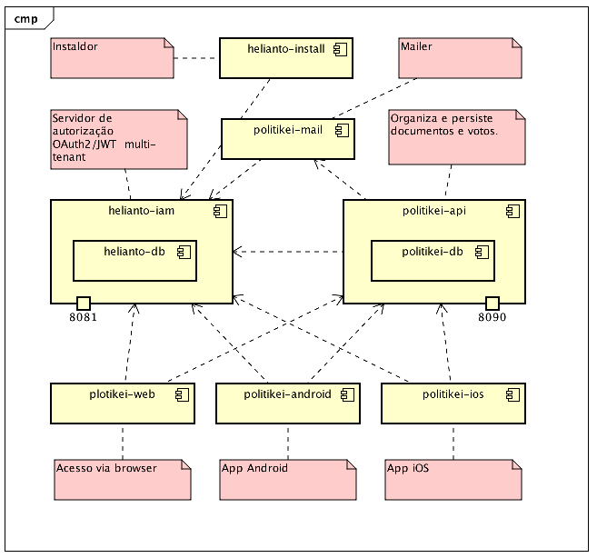

# iservport-politikei

Politkei scala API

## Visão geral

O Politikei permite ao cidadão inscrever-se para votar em projetos de lei
antes mesmo que eles sejam aprovados em uma casa legislativa. O objetivo 
é dar à sociedade e aos legisladores uma percepção mais próxima do 
eleitorado sobre os temas em debate.

## Componentes

### Helianto IAM

É um servidor de autorização capaz de registrar usuários e ceder privilégios
de acesso baseados em diferentes papéis, como por exemplo, eleitor, parlamentar,
acessor, administrador. O IAM vincula usuários a câmaras legislativas, sendo 
que uma pessoa pode se tornar eleitor em uma câmara e, por exemplo, administrador
em outra.

### Helianto Install

Facilita a instalação de câmaras e a organização inicial de grupos.

### Politikei Mail

Responsável pelo envio de e-mails.

### Politikei API

Centraliza o modelo de domínio e as regras de negócio do Politikei. É o principal
serviço a ser chamado pelas aplicações de front-end.

### Politikei Web

Front-end para acesso via navegador web.

### Politikei Android

Aplicativo Android.

### Politikei iOS
                   
Aplicativo iOS.

## API

A API está [aqui](./docs/index.html)

# Licença

Os módulos do Politikei são distribuídos pela Licença Apache 2.0

